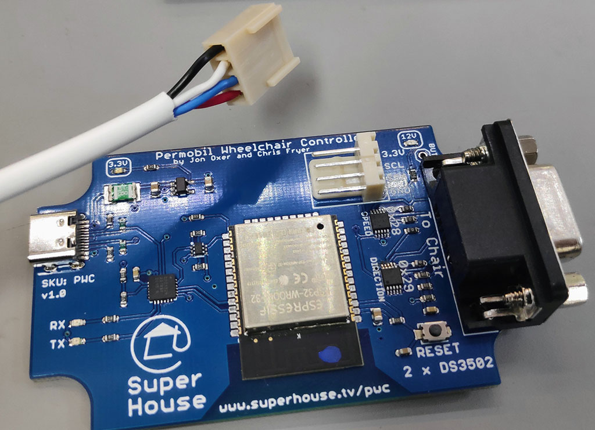

Permobil Wheelchair Controller
==============================
Copyright 2021 SuperHouse Automation Pty Ltd <www.superhouse.tv>  
Designed by Jonathan Oxer and Chris Fryer.

Connects to a Permobil electric wheelchair controller, and emulates the
signals from a wheelchair joystick so that the chair can be controlled
electronically.

Includes an I2C header so that a ZeroStick zero deflection joystick can
be connected.

Includes an ESP32 so that the chair can be controlled using WiFi or
Bluetooth. The example firmware includes support for both PS3 and PS4
game controllers.

Also exposes the "5th Button" input to the chair as a test point for
experimentation.

Features:

 * 1 x chair controller output.
 * Derives 12V from the host wheelchair controller for reference
    voltage.
 * Requires 5V power via USB.

More information is available at:

  http://www.superhouse.tv/pwc

INSTALLATION
------------
The design is saved as an EAGLE project. To use this project download
it and place the directory containing these files into the "eagle"
directory on your computer. Then open EAGLE and navigate to the project.

DISTRIBUTION
------------
The specific terms of distribution of this project are governed by the
license referenced below.

LICENSE
-------
Licensed under the TAPR Open Hardware License (www.tapr.org/OHL).
The "license" folder within this repository also contains a copy of
this license in plain text format.
